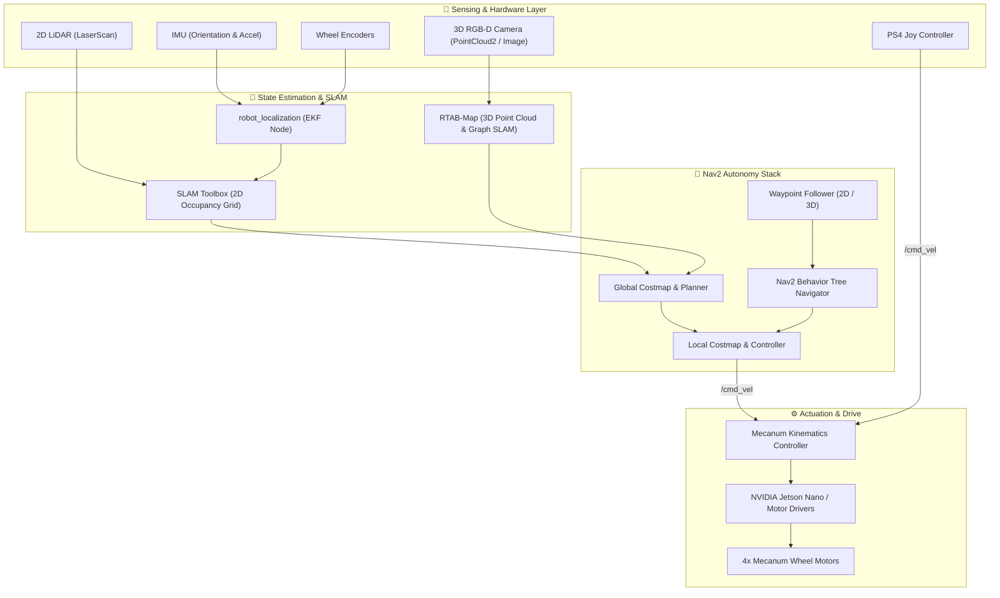

<div align="center">

# 🤖 Autonomous 4-Wheel Mecanum Mobile Robot (ROS 2)

[](https://docs.ros.org/)
[](https://ubuntu.com/)
[](https://navigation.ros.org/)
[](https://gazebosim.org/)
[](http://introlab.github.io/rtabmap/)

<p align="center">
  <b>An end-to-end Autonomous Mobile Robot (AMR) platform featuring 4-wheel omnidirectional Mecanum kinematics, 2D/3D visual SLAM, and Nav2 waypoint navigation across simulation and real hardware (NVIDIA Jetson Nano).</b><br>
  <i>(Mechatronics Engineering Technology - MtET Thesis Project)</i>
</p>

</div>

---

## 📌 Overview

This repository provides a full-stack robotics project developing an omnidirectional **Autonomous Mobile Robot (AMR)**. By leveraging independent 4-wheel **Mecanum drive kinematics**, the robot achieves 3-DOF planar mobility (omnidirectional translation and rotation) suitable for tight industrial corridors, indoor transport, and autonomous patrolling.

The project maintains **1:1 digital-twin parity** between:
1. **Simulation (`/simulation`):** High-fidelity physics modeling in **Gazebo**, custom residential/office environments, URDF/Xacro descriptions, and virtual sensor plugins.
2. **Real Hardware (`/real`):** Embedded deployment on an **NVIDIA Jetson Nano**, sensor fusion with 2D LiDAR, 3D Depth Camera, IMU, and motor encoders.

---

## ✨ Key Features

- 🔄 **Omnidirectional Kinematics:** Custom kinematics solver for 4-wheel independent Mecanum drive (forward/backward, sideways strafe, diagonal, in-place rotation).
- 🗺️ **2D & 3D Multi-Modal SLAM:**
  - **2D Mapping:** SLAM Toolbox & Cartographer for rapid laser-based 2D occupancy grid generation.
  - **3D Visual SLAM:** RTAB-Map utilizing RGB-D depth camera and point cloud processing (`pcl_ros`).
- 🧭 **Autonomous Waypoint Navigation (Nav2):** Integrated with ROS 2 Navigation Stack for global planning, local collision avoidance (DWB / TEB local planner), and autonomous multi-waypoint patrol sequences.
- 🎮 **Dual Operation Modes:** Seamless switching between autonomous mission execution and manual joystick teleoperation (PS4 controller).
- 🏗️ **Modular ROS 2 Architecture:** Clear separation of robot description, perception, navigation, hardware interface, and teleop packages.

---

## 🏗️ System Architecture



---

## 📂 Repository Structure

```
mecanum-4-wheel-ros2/
├── models/                      # Gazebo world assets, 3D meshes & environment models
├── simulation/                  # ROS 2 Simulation Stack
│   ├── iron_x/                  # Robot description (URDF/Xacro), Gazebo world & robot spawners
│   ├── nav2/                    # Nav2 2D/3D costmap params & waypoint navigation launch files
│   ├── point_cloud_perception/  # RTAB-Map 3D visual SLAM & PCL filter pipelines
│   ├── joy_stick/               # Teleop joy node integration (PS4)
│   └── test/                    # Kinematic and sensor unit tests
├── real/                        # Real Robot Deployment (NVIDIA Jetson Nano)
│   └── ironx_pro/               # Hardware drivers, live 2D/3D SLAM & real-world Nav2 launch scripts
└── README.md                    # Main documentation
```

---

## 🛠️ Prerequisites & Dependencies

### ROS 2 Packages Installation
Install required ROS 2 dependencies (replace `foxy` with `humble` or `jazzy` if using newer distributions):

```bash
sudo apt update
# Core simulation & robot description
sudo apt install -y \
  ros-foxy-joint-state-publisher-gui \
  ros-foxy-xacro \
  ros-foxy-robot-localization \
  ros-foxy-gazebo-ros-pkgs

# Navigation & SLAM
sudo apt install -y \
  ros-foxy-navigation2 \
  ros-foxy-nav2-bringup \
  ros-foxy-slam-toolbox

# 3D Perception & RTAB-Map
sudo apt install -y \
  ros-foxy-rtabmap* \
  ros-foxy-pcl-ros \
  pcl-tools

# Teleoperation
sudo apt install -y \
  ros-foxy-joy \
  ros-foxy-teleop-twist-joy
```

---

## 🚀 Quick Start Guide

### 1. Build the Workspace
```bash
# In your ROS 2 workspace root (e.g. ~/ros2_ws)
cd ~/ros2_ws
colcon build --symlink-install
source install/setup.bash
```

### 2. Gazebo Model Environment Setup
Ensure custom simulation models are available to Gazebo:
```bash
# Add simulation models to Gazebo model path
echo 'export GAZEBO_MODEL_PATH=$GAZEBO_MODEL_PATH:'$(pwd)'/src/mecanum-4-wheel-ros2/models' >> ~/.bashrc
source ~/.bashrc
```

### 3. Launch Simulation & Robot Spawner
```bash
# Spawn robot in Gazebo world with RViz visualization
ros2 launch iron_x 2d_robot.launch.py
```

### 4. Run 2D SLAM Mapping
```bash
# In a new terminal, launch SLAM Toolbox for map building
ros2 launch iron_x slam.launch.py
# Or drive around using joystick teleop:
ros2 launch joy_stick joystick.launch.py
```

### 5. Autonomous Navigation with Nav2
```bash
# 2D Goal Pose Navigation
ros2 launch nav2 2d_pose.launch.py

# Or run automated multi-waypoint patrol sequence
ros2 launch nav2 2d_waypoint.launch.py
```

### 6. Real Robot Hardware Execution (Jetson Nano)
```bash
# On the physical robot:
ros2 launch ironx_pro 2d_nav.launch.py
# For 3D RTAB-Map autonomous waypoint navigation:
ros2 launch ironx_pro 3d_waypoint.launch.py
```

---

## 📄 License

This project is licensed under the MIT License - see the [LICENSE](./LICENSE) file for details.
