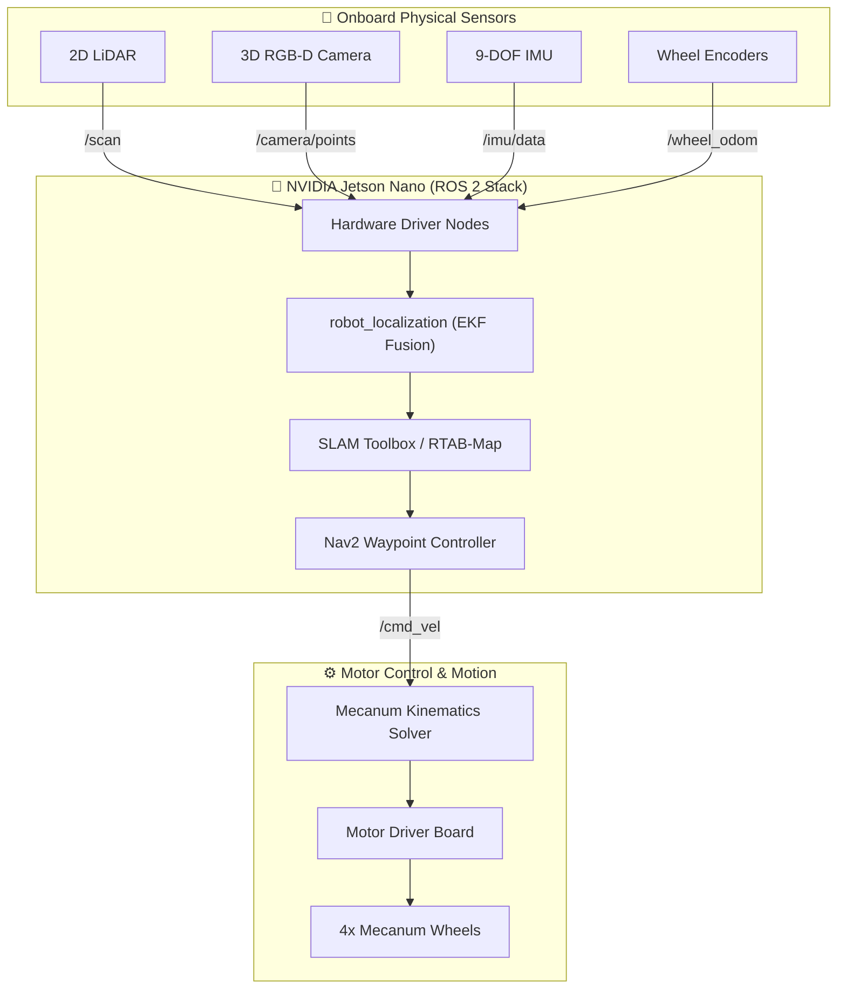

<div align="center">

# 🤖 Physical Robot Deployment: IRON-X PRO (NVIDIA Jetson Nano)

[](https://developer.nvidia.com/embedded/jetson-nano)
[](https://github.com/iaun123/mecanum-4-wheel-ros2)
[](https://docs.ros.org/)
[](https://www.slamtec.com/)
[](https://www.intelrealsense.com/)
[](https://navigation.ros.org/)

<p align="center">
  <b>Production deployment configurations, sensor drivers, 2D/3D SLAM mapping, and Nav2 autonomous navigation running directly on the physical IRON-X PRO 4-Wheel Mecanum mobile robot.</b>
</p>

</div>

---

## 📌 Overview

This directory houses the onboard production ROS 2 packages deployed to the **IRON-X PRO** autonomous mobile robot platform, powered by an **NVIDIA Jetson Nano** single-board computer. It interfaces real-world sensors (LiDAR, 3D Depth Camera, IMU, Motor Encoders) with the ROS 2 autonomy stack to achieve real-time SLAM mapping and autonomous waypoint navigation.

---

## 🔌 Hardware Specifications & Sensor Suite

```
Physical Robot Architecture (IRON-X PRO Platform)
├── 🤖 Robot Base: IRON-X PRO 4-Wheel Mecanum Omnidirectional AMR
├── 🧠 Central Compute: NVIDIA Jetson Nano (ARM64, Ubuntu Linux, ROS 2)
├── 🚗 Drivetrain: 4x Independent DC Geared Motors with Mecanum Wheels
├── 📐 Sensors & Perception:
│   ├── 📡 2D LiDAR: 360° Laser Scanner for obstacle detection & 2D occupancy mapping
│   ├── 📷 3D RGB-D Depth Camera: Point cloud generation & visual feature tracking
│   ├── 🧭 IMU (9-DOF): Orientation, angular velocity, and linear acceleration
│   └── ⚙️ Motor Encoders: High-resolution wheel ticks for odometry calculation
└── 🔋 Power Delivery: 12V Li-ion Battery pack with regulated step-down converters
```

---

## 🏗️ Hardware Dataflow Architecture



---

## 🚀 Operating Procedures & Launch Guide

### 1. Build the Workspace on Jetson Nano
```bash
cd ~/ros2_ws
colcon build --packages-select ironx_pro --symlink-install
source install/setup.bash
```

---

### 2. 2D SLAM Mapping
Generate a high-accuracy 2D laser occupancy grid map of the environment:

```bash
# Launch 2D SLAM Mapping & Hardware Drivers
ros2 launch ironx_pro 2d_map.launch.py
```
*Drive the robot using teleoperation to cover the entire space, then save the map:*
```bash
ros2 run nav2_map_server map_saver_cli -f ~/map_name
```

---

### 3. 2D Autonomous Navigation & Waypoint Patrol
Once the map is saved, execute autonomous goal navigation:

```bash
# Standard 2D Goal Pose Navigation
ros2 launch ironx_pro 2d_nav.launch.py

# Or automated multi-waypoint sequence patrol
ros2 launch ironx_pro 2d_waypoint.launch.py
```

---

### 4. 3D Visual SLAM (RTAB-Map)
Perform dense 3D visual graph SLAM utilizing the RGB-D depth camera:

```bash
# Launch RTAB-Map 3D Mapping on physical robot
ros2 launch ironx_pro rtab_map.launch.py

# Generate 2D Occupancy Grid from 3D Point Cloud
ros2 launch ironx_pro occupancy_grid.launch.py
```

---

### 5. 3D Waypoint Navigation
Navigate through multi-dimensional waypoint trajectories with 3D point cloud obstacle avoidance:

```bash
# 3D Autonomous Navigation
ros2 launch ironx_pro 3d_nav.launch.py

# 3D Automated Waypoint Sequence
ros2 launch ironx_pro 3d_waypoint.launch.py
```

---

## 📦 Launch Scripts & Python Tools Reference

| File | Type | Description |
| :--- | :---: | :--- |
| [`2d_map.launch.py`](./ironx_pro/launch/2d_map.launch.py) | Launch | 2D LiDAR SLAM mapping node with Cartographer / SLAM Toolbox. |
| [`2d_nav.launch.py`](./ironx_pro/launch/2d_nav.launch.py) | Launch | 2D Nav2 navigation stack bringup with costmaps & local planner. |
| [`2d_waypoint.launch.py`](./ironx_pro/launch/2d_waypoint.launch.py) | Launch | Autonomous sequential waypoint execution in 2D space. |
| [`3d_nav.launch.py`](./ironx_pro/launch/3d_nav.launch.py) | Launch | 3D visual navigation utilizing RGB-D point cloud perception. |
| [`3d_waypoint.launch.py`](./ironx_pro/launch/3d_waypoint.launch.py) | Launch | Autonomous 3D waypoint follower. |
| [`rtab_map.launch.py`](./ironx_pro/launch/rtab_map.launch.py) | Launch | Real-time Appearance-Based Mapping (RTAB-Map) 3D visual SLAM. |
| [`occupancy_grid.launch.py`](./ironx_pro/launch/occupancy_grid.launch.py) | Launch | Converts 3D point cloud data into a 2D costmap occupancy grid. |
| [`robot_navigator.py`](./ironx_pro/scripts/robot_navigator.py) | Python | Programmatic Nav2 Commander API interface for mission control. |
| [`save_pose.py`](./ironx_pro/scripts/save_pose.py) | Python | Utility to record and store current robot waypoint coordinates. |
| [`euler_quaternion.py`](./ironx_pro/scripts/euler_quaternion.py) | Python | Math helper for Euler angles (RPY) to Quaternion transformations. |

---

## 👨‍💻 Author

**Chananya Meepayung (Aun)**
- **Role:** Robotics Software Engineer
- **GitHub:** [@iaun123](https://github.com/iaun123)
- **LinkedIn:** [chananya-meepayung](https://www.linkedin.com/in/chananya-meepayung-b39335356/)
- **Email:** chananyaaun123@gmail.com
